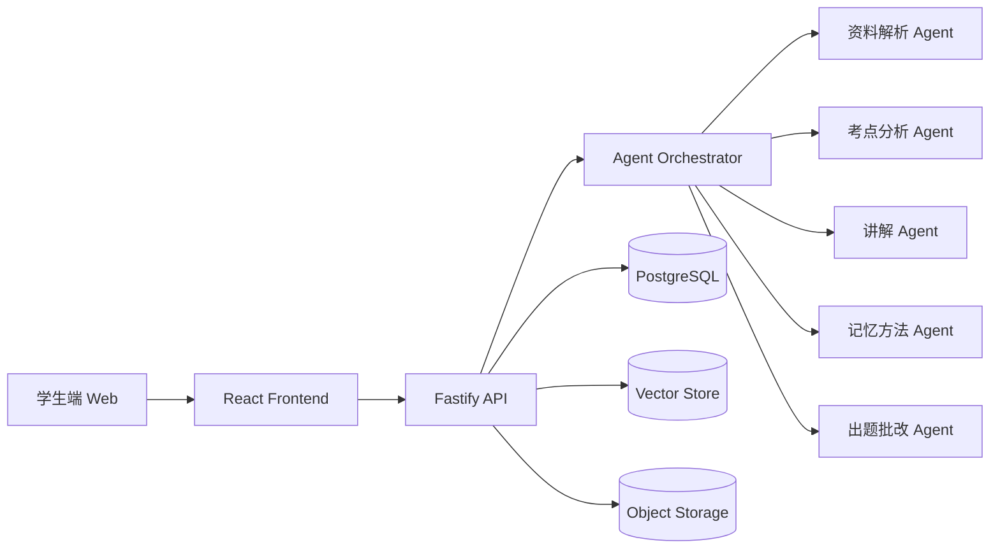

# FinalMate 系统架构

## 一、整体架构

当前压缩包中，数据库、向量库和对象存储以 Mock 数据替代，方便直接运行和展示。

## 二、前端结构

- `App.tsx`：整体页面编排
- `components`：上传面板、路径面板、讲解卡片、热力图、思维导图、出题批改等
- `data/mock.ts`：前端兜底数据
- `lib/api.ts`：统一 API 请求封装
- `styles.css`：所有样式

## 三、后端结构

- `server.ts`：Fastify 入口
- `routes`：课程、分析、Agent、题目、思维导图接口
- `agents`：资料解析、考点分析、讲解、记忆、出题、批改逻辑
- `data`：Mock 课程与往年卷数据

## 四、Agent 协作流

1. 用户上传资料。
2. 资料解析 Agent 生成知识点。
3. 考点分析 Agent 结合往年卷计算热度。
4. 学习推进 Agent 根据当前掌握度和考频给下一步建议。
5. 讲解 Agent 用例子讲懂当前知识点。
6. 记忆方法 Agent 生成口诀、类比、对照表。
7. 出题 Agent 生成题目。
8. 批改 Agent 根据答案评分并写入错题本。
9. 可视化 Agent 更新热力图和思维导图。

## 五、真实上线建议

MVP 后续可以替换以下模块：

- Mock 文件上传 → 对象存储
- Mock 文本解析 → PDF/DOCX/OCR 解析
- Mock 检索 → Embedding + 向量数据库
- Mock Agent → 大模型 API
- 本地状态 → PostgreSQL + Redis
- 单用户 → 登录、课程空间、多用户权限

